# DeepFilterNet
A Low Complexity Speech Enhancement Framework for Full-Band Audio (48kHz) using on Deep Filtering.


For PipeWire integration as a virtual noise suppression microphone look [here](https://github.com/Rikorose/DeepFilterNet/blob/main/ladspa/README.md).


# 🎬 DeepFilterNet Video Audio Enhancer (DeepFilterNet is described further on.)

> **AI-Powered Video Audio Enhancement Tool** - Keep your video quality pristine while making audio crystal clear!

[](https://www.python.org/downloads/)
[](https://github.com/Rikorose/DeepFilterNet)
[](https://gradio.app/)
[](LICENSE)
[](https://github.com/USERNAME/REPO/stargazers)

## ✨ Key Features

- 🎯 **Lossless Video Quality**: 100% preservation of original video resolution
- 🎧 **AI Audio Enhancement**: Background noise removal with DeepFilterNet3
- 🔊 **Mono to Stereo**: Convert single-channel audio to dual-channel
- 🌐 **User-Friendly Interface**: Drag-and-drop web interface
- ⚡ **GPU Acceleration**: CUDA support for faster processing
- 📱 **Multiple Formats**: Support for MP4, AVI, MOV, MKV, and more

## 🎥 Demo

### Before & After
| Before Processing | After Processing |
|-------------------|------------------|
| 🔊 Background noise + voice | 🎤 Crystal clear voice only |
| 📱 Audio in one ear only | 🎧 Clear sound in both ears |

### Processing Pipeline

```mermaid
graph LR
    A[📼 Upload Video] --> B[🎵 Extract Audio]
    B --> C[🤖 AI Enhancement]
    C --> D[🔊 Stereo Conversion]
    D --> E[📹 Video Recreation]
    E --> F[✨ Done!]
```


## 🚀 Quick Start

### Windows Users (Recommended)

**1. Clone Repository**
```bash
git clone https://github.com/YOUR_USERNAME/DeepFilterNet-Video-Enhancer.git
cd DeepFilterNet-Video-Enhancer
```

**2. One-Click Setup & Run**
```bash
# Install everything automatically
make_venv.bat

# Run the application  
run_gpu.bat
```

That's it! The application will open at `http://localhost:7860` in your browser.

### Manual Installation (All Platforms)

**1. Clone Repository**
```bash
git clone https://github.com/YOUR_USERNAME/DeepFilterNet-Video-Enhancer.git
cd DeepFilterNet-Video-Enhancer
```

**2. Create Virtual Environment**
```bash
# Windows
py -3.10 -m venv venv
venv\Scripts\activate

# Linux/Mac  
python3 -m venv venv
source venv/bin/activate
```

**3. Install Dependencies**
```bash
# GPU version (CUDA 12.8)
pip install torch==2.7.0 torchvision==0.22.0 torchaudio==2.7.0 --index-url https://download.pytorch.org/whl/cu128

# Install remaining packages
pip install -r requirements.txt

# FFmpeg (Required)
# Windows: Download from https://ffmpeg.org/download.html
# Ubuntu: sudo apt install ffmpeg  
# macOS: brew install ffmpeg
```

**4. Run Application**
```bash
python app.py
```

Open your browser and navigate to `http://localhost:7860`!

## 📋 Supported Formats

### Input Formats
- **Video**: MP4, AVI, MOV, MKV, WMV, FLV
- **Audio**: Any sample rate (auto-converted to 48kHz)

### Output Format
- **Video**: MP4 (H.264 + AAC)
- **Quality**: Same resolution as original

## 🔧 System Requirements

| Component | Minimum | Recommended |
|-----------|---------|-------------|
| **Python** | 3.8+ | 3.10+ (as used in batch scripts) |
| **RAM** | 8GB | 16GB+ |
| **GPU** | Optional | NVIDIA GTX 1060+ with CUDA 12.8 |
| **Storage** | 5GB | 10GB+ |
| **FFmpeg** | Required | Latest version |

### CUDA Support
The batch scripts automatically install PyTorch with CUDA 12.8 support:
```bash
torch==2.7.0+cu128 torchvision==0.22.0+cu128 torchaudio==2.7.0+cu128
```

For different CUDA versions, modify the `make_venv.bat` script or install manually.

## 📁 Project Structure

```
DeepFilterNet-Video-Enhancer/
├── 📄 app.py                    # Main application file
├── 📄 requirements.txt          # Python dependencies
├── 🪟 make_venv.bat            # Windows setup script
├── 🪟 run_gpu.bat              # Windows run script  
├── 📖 README.md                # This file
├── 📋 LICENSE                  # MIT License
└── 📁 examples/                # Sample videos and results
    ├── 🎬 demo_input.mp4       # Example noisy video
    └── 🎬 demo_output.mp4      # Enhanced result
```

## 🛠️ Batch Scripts (Windows)

### `make_venv.bat` - Automatic Setup
This script automatically:
- Creates Python 3.10 virtual environment
- Installs PyTorch with CUDA 12.8 support
- Installs all required dependencies from `requirements.txt`
- Sets up everything needed to run the application

### `run_gpu.bat` - Quick Launch
This script:
- Activates the virtual environment
- Launches the application (`app.py`)
- Opens the web interface on `http://localhost:7860`

### Usage Examples
```bash
# First time setup
make_venv.bat

# Daily usage
run_gpu.bat

# Manual activation (if needed)
venv\Scripts\activate
python app.py
```

### Input Formats
- **Video**: MP4, AVI, MOV, MKV, WMV, FLV
- **Audio**: Any sample rate (auto-converted to 48kHz)

### Output Format
- **Video**: MP4 (H.264 + AAC)
- **Quality**: Same resolution as original

## 🎛️ Usage Guide

### Basic Usage
1. **Upload Video**: Drag and drop or click to select your video file
2. **Configure Options**: 
   - 🔧 Post-filter: Additional suppression for very noisy sections
   - 🔊 Stereo Conversion: Convert mono audio to stereo
3. **Start Processing**: Click the 🚀 button
4. **Download Result**: Download enhanced video when complete

### Advanced Configuration
```python
# Adjust chunk size for GPU memory issues
chunk_size = 48000 * 15  # 15-second chunks (default: 30s)

# CPU-only mode
os.environ["CUDA_VISIBLE_DEVICES"] = ""
```

## 🧠 Technology Stack

### AI Models
- **[DeepFilterNet3](https://github.com/Rikorose/DeepFilterNet)**: Real-time speech enhancement
- **PyTorch**: Deep learning framework
- **CUDA**: GPU acceleration support

### Audio/Video Processing
- **FFmpeg**: Video/audio encoding and processing
- **torchaudio**: Audio processing library
- **librosa**: Audio analysis toolkit

### User Interface
- **Gradio**: Web UI framework
- **Responsive Design**: Mobile-friendly interface

## 📊 Performance Benchmarks

| Video Length | GPU (RTX 3080) | CPU (i7-10700K) |
|--------------|----------------|-----------------|
| 1 minute | ~20 seconds | ~2 minutes |
| 5 minutes | ~1.5 minutes | ~8 minutes |
| 15 minutes | ~4 minutes | ~25 minutes |

*Actual performance varies based on hardware and video complexity.

## 🛠️ Troubleshooting

### Common Issues

**Q: `make_venv.bat` fails with Python not found**
```bash
# Solution: Install Python 3.10 or modify the script
# Download Python 3.10 from python.org
# Or change py -3.10 to py -3.11 or python in make_venv.bat
```

**Q: Getting GPU memory errors during processing**
```bash
# Solution 1: Reduce chunk size in app.py
chunk_size = 48000 * 15  # 30s → 15s

# Solution 2: Use CPU mode
# Edit app.py and add: os.environ["CUDA_VISIBLE_DEVICES"] = ""
```

**Q: FFmpeg not found error**
```bash
# Windows: Download from https://ffmpeg.org/download.html and add to PATH
# Ubuntu/Debian: sudo apt update && sudo apt install ffmpeg  
# macOS: brew install ffmpeg
```

**Q: `run_gpu.bat` doesn't start the application**
```bash
# Check if virtual environment was created properly
# Re-run make_venv.bat
# Check app.py exists in the directory
```

**Q: Processing takes too long**
- Verify GPU is being used: Check Task Manager > Performance > GPU
- For long videos (15+ minutes), processing time is normal
- Consider using shorter video clips for testing

**Q: CUDA version mismatch**
```bash
# Check your CUDA version: nvidia-smi
# Modify make_venv.bat to use appropriate PyTorch version:
# CUDA 11.8: --index-url https://download.pytorch.org/whl/cu118
# CPU only: --index-url https://download.pytorch.org/whl/cpu
```

### Error Messages
- `cuDNN error`: GPU memory issue → Use CPU mode or smaller chunks
- `Unicode decode error`: File path contains special characters → Use English paths
- `Audio backend error`: Install missing audio libraries → `pip install librosa soundfile`

## 🎯 Roadmap

- [ ] **Batch Processing**: Process multiple files simultaneously
- [ ] **Cloud Deployment**: Hugging Face Spaces integration
- [ ] **Real-time Processing**: Live webcam audio enhancement
- [ ] **Mobile Apps**: iOS/Android native applications
- [ ] **API Server**: REST API for programmatic access
- [ ] **Plugin System**: Support for custom audio filters

## 🤝 Contributing

Contributions are welcome! Here's how you can help:

1. Fork the repository
2. Create a feature branch (`git checkout -b feature/amazing-feature`)
3. Commit your changes (`git commit -m 'Add amazing feature'`)
4. Push to the branch (`git push origin feature/amazing-feature`)
5. Open a Pull Request

### Development Setup
```bash
# Windows developers
make_venv.bat                    # Create environment
venv\Scripts\activate           # Activate manually
pip install -r requirements-dev.txt  # Dev dependencies

# Run tests
python -m pytest tests/

# Code formatting  
black app.py
flake8 app.py
```

### Modifying Batch Scripts

**Customizing `make_venv.bat`:**
```batch
@echo off
REM Change Python version if needed
py -3.11 -m venv venv            # Use Python 3.11 instead

REM Modify CUDA version for your GPU
cmd /c "pip install torch==2.7.0 torchvision==0.22.0 torchaudio==2.7.0 --index-url https://download.pytorch.org/whl/cu118"

REM Add custom packages
pip install your-custom-package
```

**Customizing `run_gpu.bat`:**
```batch
@echo off
call venv\Scripts\activate

REM Add environment variables
set CUDA_VISIBLE_DEVICES=0       # Use specific GPU
set OMP_NUM_THREADS=4           # Limit CPU threads

REM Launch with custom parameters  
python app.py --port 8080 --share  # Custom port & public sharing
pause
```

### Contribution Guidelines
- Follow PEP 8 style guidelines
- Add tests for new features
- Update documentation
- Keep commits atomic and descriptive

## 📈 Project Stats

- ⭐ **Stars**: Growing community support
- 🍴 **Forks**: Active development
- 📥 **Downloads**: Thousands of users
- 🐛 **Issues**: Actively maintained
- 👥 **Contributors**: Open to collaboration

## 🔬 Technical Details

### Architecture
```
┌─────────────────┐    ┌──────────────────┐    ┌─────────────────┐
│   Gradio UI     │    │  DeepFilterNet3  │    │   FFmpeg Core   │
│                 │◄──►│                  │◄──►│                 │
│ File Upload     │    │ Noise Removal    │    │ Video/Audio     │
│ Progress Track  │    │ Audio Enhancement│    │ Processing      │
└─────────────────┘    └──────────────────┘    └─────────────────┘
```

### Processing Flow
1. **Video Analysis**: Extract metadata and audio stream
2. **Audio Preprocessing**: Resample to 48kHz, convert to mono if needed
3. **AI Enhancement**: DeepFilterNet3 noise removal and enhancement
4. **Post-processing**: Optional stereo conversion and filtering
5. **Video Reconstruction**: Combine enhanced audio with original video

## 📄 License

This project is licensed under the MIT License - see the [LICENSE](LICENSE) file for details.

## 🙏 Acknowledgments

- **[Rikorose/DeepFilterNet](https://github.com/Rikorose/DeepFilterNet)**: Core AI model and framework
- **[Gradio Team](https://gradio.app/)**: Excellent web UI framework
- **[FFmpeg Project](https://ffmpeg.org/)**: Powerful multimedia processing
- **All Contributors**: Everyone who helped improve this project

## 📞 Contact & Support

- **Developer**: [YOUR_NAME]
- **Email**: your.email@example.com
- **GitHub**: [@YOUR_USERNAME](https://github.com/YOUR_USERNAME)
- **Issues**: [Report bugs or request features](../../issues)
- **Discussions**: [Join the community](../../discussions)

## 🌟 Show Your Support

If this project helped you, please consider:
- ⭐ Starring the repository
- 🍴 Forking for your own experiments  
- 📢 Sharing with others who might benefit
- 💖 [Sponsoring the development](https://github.com/sponsors/YOUR_USERNAME)

---

<div align="center">

**⭐ Star this repo if you found it useful! ⭐**

[🐛 Report Bug](../../issues/new?template=bug_report.md) · [💡 Request Feature](../../issues/new?template=feature_request.md) · [📖 Documentation](../../wiki) · [💬 Discussions](../../discussions)

**Made with ❤️ and AI**

</div>

### Demo

https://github.com/Rikorose/DeepFilterNet/assets/16517898/79679fd7-de73-4c22-948c-891927c7d2ca

To run the demo (linux only) use:
```bash
cargo +nightly run -p df-demo --features ui --bin df-demo --release
```

### News

- New DeepFilterNet Demo: *DeepFilterNet: Perceptually Motivated Real-Time Speech Enhancement*
  - Paper: https://arxiv.org/abs/2305.08227
  - Video: https://youtu.be/EO7n96YwnyE

- New Multi-Frame Filtering Paper: *Deep Multi-Frame Filtering for Hearing Aids*
  - Paper: https://arxiv.org/abs/2305.08225

- Real-time version and a LADSPA plugin
  - [Pre-compiled binary](#deep-filter), no python dependencies. Usage: `deep-filter audio-file.wav`
  - [LADSPA plugin](ladspa/) with pipewire filter-chain integration for real-time noise reduction on your mic.

- DeepFilterNet2 Paper: *DeepFilterNet2: Towards Real-Time Speech Enhancement on Embedded Devices for Full-Band Audio*
  - Paper: https://arxiv.org/abs/2205.05474
  - Samples: https://rikorose.github.io/DeepFilterNet2-Samples/
  - Demo: https://huggingface.co/spaces/hshr/DeepFilterNet2

- Original DeepFilterNet Paper: *DeepFilterNet: A Low Complexity Speech Enhancement Framework for Full-Band Audio based on Deep Filtering*
  - Paper: https://arxiv.org/abs/2110.05588
  - Samples: https://rikorose.github.io/DeepFilterNet-Samples/
  - Demo: https://huggingface.co/spaces/hshr/DeepFilterNet
  - Video Lecture: https://youtu.be/it90gBqkY6k

## Usage

### deep-filter

Download a pre-compiled deep-filter binary from the [release page](https://github.com/Rikorose/DeepFilterNet/releases/).
You can use `deep-filter` to suppress noise in noisy .wav audio files. Currently, only wav files with a sampling rate of 48kHz are supported.

```bash
USAGE:
    deep-filter [OPTIONS] [FILES]...

ARGS:
    <FILES>...

OPTIONS:
    -D, --compensate-delay
            Compensate delay of STFT and model lookahead
    -h, --help
            Print help information
    -m, --model <MODEL>
            Path to model tar.gz. Defaults to DeepFilterNet2.
    -o, --out-dir <OUT_DIR>
            [default: out]
    --pf
            Enable postfilter
    -v, --verbose
            Logging verbosity
    -V, --version
            Print version information
```

If you want to use the pytorch backend e.g. for GPU processing, see further below for the Python usage.

### DeepFilterNet Framework

This framework supports Linux, MacOS and Windows. Training is only tested under Linux. The framework is structured as follows:

* `libDF` contains Rust code used for data loading and augmentation.
* `DeepFilterNet` contains DeepFilterNet code training, evaluation and visualization as well as pretrained model weights.
* `pyDF` contains a Python wrapper of libDF STFT/ISTFT processing loop.
* `pyDF-data` contains a Python wrapper of libDF dataset functionality and provides a pytorch data loader.
* `ladspa` contains a LADSPA plugin for real-time noise suppression.
* `models` contains pretrained for usage in DeepFilterNet (Python) or libDF/deep-filter (Rust)

### DeepFilterNet Python: PyPI

Install the DeepFilterNet Python wheel via pip:
```bash
# Install cpu/cuda pytorch (>=1.9) dependency from pytorch.org, e.g.:
pip install torch torchaudio -f https://download.pytorch.org/whl/cpu/torch_stable.html
# Install DeepFilterNet
pip install deepfilternet
# Or install DeepFilterNet including data loading functionality for training (Linux only)
pip install deepfilternet[train]
```

To enhance noisy audio files using DeepFilterNet run
```bash
# Specify an output directory with --output-dir [OUTPUT_DIR]
deepFilter path/to/noisy_audio.wav
```

### Manual Installation

Install cargo via [rustup](https://rustup.rs/). Usage of a `conda` or `virtualenv` recommended.
Please read the comments and only execute the commands that you need.

Installation of python dependencies and libDF:
```bash
cd path/to/DeepFilterNet/  # cd into repository
# Recommended: Install or activate a python env
# Mandatory: Install cpu/cuda pytorch (>=1.8) dependency from pytorch.org, e.g.:
pip install torch torchaudio -f https://download.pytorch.org/whl/cpu/torch_stable.html
# Install build dependencies used to compile libdf and DeepFilterNet python wheels
pip install maturin poetry

#  Install remaining DeepFilterNet python dependencies
# *Option A:* Install DeepFilterNet python wheel globally within your environment. Do this if you want use
# this repos as is, and don't want to develop within this repository.
poetry -C DeepFilterNet install -E train -E eval
# *Option B:* If you want to develop within this repo, install only dependencies and work with the repository version
poetry -C DeepFilterNet install -E train -E eval --no-root
export PYTHONPATH=$PWD/DeepFilterNet # And set the python path correctly

# Build and install libdf python package required for enhance.py
maturin develop --release -m pyDF/Cargo.toml
# *Optional*: Install libdfdata python package with dataset and dataloading functionality for training
# Required build dependency: HDF5 headers (e.g. ubuntu: libhdf5-dev)
maturin develop --release -m pyDF-data/Cargo.toml
# If you have troubles with hdf5 you may try to build and link hdf5 statically:
maturin develop --release --features hdf5-static -m pyDF-data/Cargo.toml
```

### Use DeepFilterNet from command line

To enhance noisy audio files using DeepFilterNet run
```bash
$ python DeepFilterNet/df/enhance.py --help
usage: enhance.py [-h] [--model-base-dir MODEL_BASE_DIR] [--pf] [--output-dir OUTPUT_DIR] [--log-level LOG_LEVEL] [--compensate-delay]
                  noisy_audio_files [noisy_audio_files ...]

positional arguments:
  noisy_audio_files     List of noise files to mix with the clean speech file.

optional arguments:
  -h, --help            show this help message and exit
  --model-base-dir MODEL_BASE_DIR, -m MODEL_BASE_DIR
                        Model directory containing checkpoints and config.
                        To load a pretrained model, you may just provide the model name, e.g. `DeepFilterNet`.
                        By default, the pretrained DeepFilterNet2 model is loaded.
  --pf                  Post-filter that slightly over-attenuates very noisy sections.
  --output-dir OUTPUT_DIR, -o OUTPUT_DIR
                        Directory in which the enhanced audio files will be stored.
  --log-level LOG_LEVEL
                        Logger verbosity. Can be one of (debug, info, error, none)
  --compensate-delay, -D
                        Add some paddig to compensate the delay introduced by the real-time STFT/ISTFT implementation.

# Enhance audio with original DeepFilterNet
python DeepFilterNet/df/enhance.py -m DeepFilterNet path/to/noisy_audio.wav

# Enhance audio with DeepFilterNet2
python DeepFilterNet/df/enhance.py -m DeepFilterNet2 path/to/noisy_audio.wav
```

### Use DeepFilterNet within your Python script

```py
from df import enhance, init_df

model, df_state, _ = init_df()  # Load default model
enhanced_audio = enhance(model, df_state, noisy_audio)
```

See [here](https://github.com/Rikorose/DeepFilterNet/blob/main/scripts/external_usage.py) for a full example.

### Training

The entry point is `DeepFilterNet/df/train.py`. It expects a data directory containing HDF5 dataset
as well as a dataset configuration json file.

So, you first need to create your datasets in HDF5 format. Each dataset typically only
holds training, validation, or test set of noise, speech or RIRs.
```py
# Install additional dependencies for dataset creation
pip install h5py librosa soundfile
# Go to DeepFilterNet python package
cd path/to/DeepFilterNet/DeepFilterNet
# Prepare text file (e.g. called training_set.txt) containing paths to .wav files
#
# usage: prepare_data.py [-h] [--num_workers NUM_WORKERS] [--max_freq MAX_FREQ] [--sr SR] [--dtype DTYPE]
#                        [--codec CODEC] [--mono] [--compression COMPRESSION]
#                        type audio_files hdf5_db
#
# where:
#   type: One of `speech`, `noise`, `rir`
#   audio_files: Text file containing paths to audio files to include in the dataset
#   hdf5_db: Output HDF5 dataset.
python df/scripts/prepare_data.py --sr 48000 speech training_set.txt TRAIN_SET_SPEECH.hdf5
```
All datasets should be made available in one dataset folder for the train script.

The dataset configuration file should contain 3 entries: "train", "valid", "test". Each of those
contains a list of datasets (e.g. a speech, noise and a RIR dataset). You can use multiple speech
or noise dataset. Optionally, a sampling factor may be specified that can be used to over/under-sample
the dataset. Say, you have a specific dataset with transient noises and want to increase the amount
of non-stationary noises by oversampling. In most cases you want to set this factor to 1.

<details>
  <summary>Dataset config example:</summary>
<p>
  
`dataset.cfg`

```json
{
  "train": [
    [
      "TRAIN_SET_SPEECH.hdf5",
      1.0
    ],
    [
      "TRAIN_SET_NOISE.hdf5",
      1.0
    ],
    [
      "TRAIN_SET_RIR.hdf5",
      1.0
    ]
  ],
  "valid": [
    [
      "VALID_SET_SPEECH.hdf5",
      1.0
    ],
    [
      "VALID_SET_NOISE.hdf5",
      1.0
    ],
    [
      "VALID_SET_RIR.hdf5",
      1.0
    ]
  ],
  "test": [
    [
      "TEST_SET_SPEECH.hdf5",
      1.0
    ],
    [
      "TEST_SET_NOISE.hdf5",
      1.0
    ],
    [
      "TEST_SET_RIR.hdf5",
      1.0
    ]
  ]
}
```

</p>
</details>

Finally, start the training script. The training script may create a model `base_dir` if not
existing used for logging, some audio samples, model checkpoints, and config. If no config file is
found, it will create a default config. See
[DeepFilterNet/pretrained_models/DeepFilterNet](https://github.com/Rikorose/DeepFilterNet/blob/main/DeepFilterNet/pretrained_models/DeepFilterNet/config.ini)
for a config file.
```py
# usage: train.py [-h] [--debug] data_config_file data_dir base_dir
python df/train.py path/to/dataset.cfg path/to/data_dir/ path/to/base_dir/
```

## Citation Guide

To reproduce any metrics, we recomend to use the python implementation via `pip install deepfilternet`.

If you use this framework, please cite: *DeepFilterNet: A Low Complexity Speech Enhancement Framework for Full-Band Audio based on Deep Filtering*
```bibtex
@inproceedings{schroeter2022deepfilternet,
  title={{DeepFilterNet}: A Low Complexity Speech Enhancement Framework for Full-Band Audio based on Deep Filtering}, 
  author = {Schröter, Hendrik and Escalante-B., Alberto N. and Rosenkranz, Tobias and Maier, Andreas},
  booktitle={ICASSP 2022 IEEE International Conference on Acoustics, Speech and Signal Processing (ICASSP)},
  year={2022},
  organization={IEEE}
}
```

If you use the DeepFilterNet2 model, please cite: *DeepFilterNet2: Towards Real-Time Speech Enhancement on Embedded Devices for Full-Band Audio*

```bibtex
@inproceedings{schroeter2022deepfilternet2,
  title = {{DeepFilterNet2}: Towards Real-Time Speech Enhancement on Embedded Devices for Full-Band Audio},
  author = {Schröter, Hendrik and Escalante-B., Alberto N. and Rosenkranz, Tobias and Maier, Andreas},
  booktitle={17th International Workshop on Acoustic Signal Enhancement (IWAENC 2022)},
  year = {2022},
}
```

If you use the DeepFilterNet3 model, please cite: *DeepFilterNet: Perceptually Motivated Real-Time Speech Enhancement*

```bibtex
@inproceedings{schroeter2023deepfilternet3,
  title = {{DeepFilterNet}: Perceptually Motivated Real-Time Speech Enhancement},
  author = {Schröter, Hendrik and Rosenkranz, Tobias and Escalante-B., Alberto N. and Maier, Andreas},
  booktitle={INTERSPEECH},
  year = {2023},
}
```

If you use the multi-frame beamforming algorithms. please cite *Deep Multi-Frame Filtering for Hearing Aids*

```bibtex
@inproceedings{schroeter2023deep_mf,
  title = {Deep Multi-Frame Filtering for Hearing Aids},
  author = {Schröter, Hendrik and Rosenkranz, Tobias and Escalante-B., Alberto N. and Maier, Andreas},
  booktitle={INTERSPEECH},
  year = {2023},
}
```

## License

DeepFilterNet is free and open source! All code in this repository is dual-licensed under either:

* MIT License ([LICENSE-MIT](LICENSE-MIT) or [http://opensource.org/licenses/MIT](http://opensource.org/licenses/MIT))
* Apache License, Version 2.0 ([LICENSE-APACHE](LICENSE-APACHE) or [http://www.apache.org/licenses/LICENSE-2.0](http://www.apache.org/licenses/LICENSE-2.0))

at your option. This means you can select the license you prefer!

Unless you explicitly state otherwise, any contribution intentionally submitted for inclusion in the work by you, as defined in the Apache-2.0 license, shall be dual licensed as above, without any additional terms or conditions.
